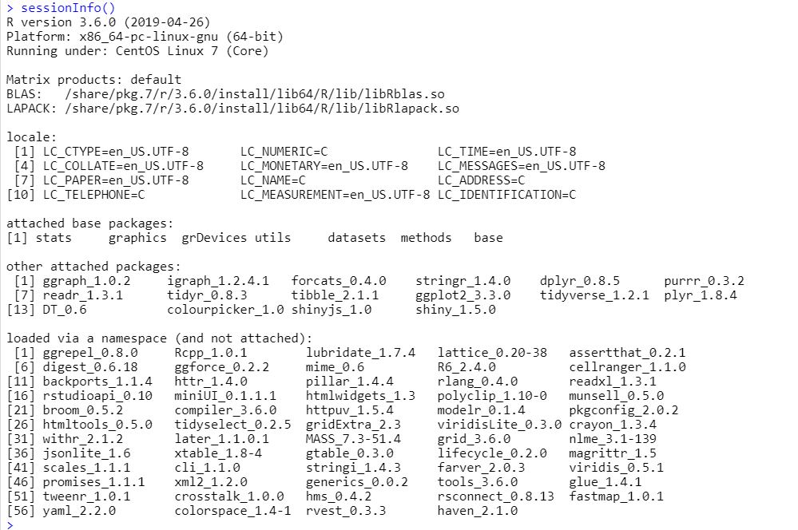
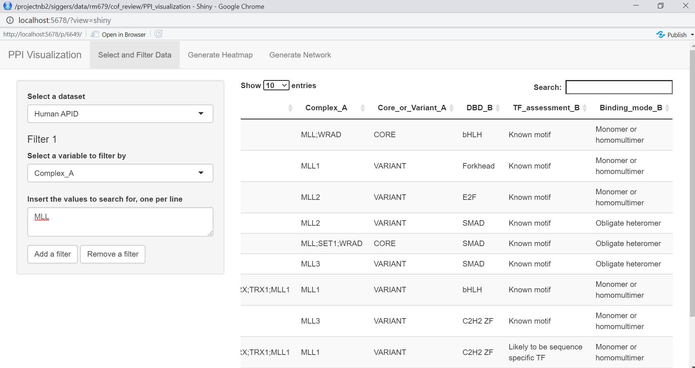
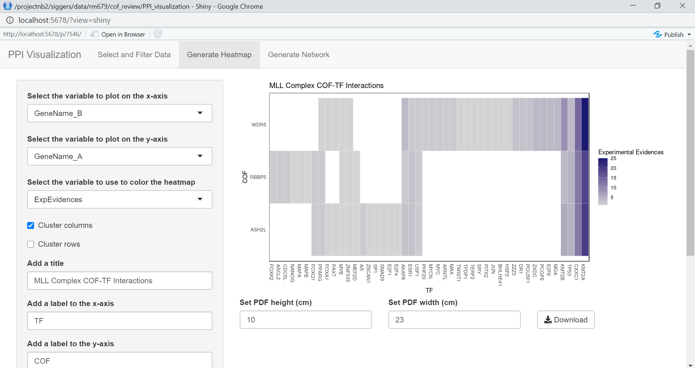
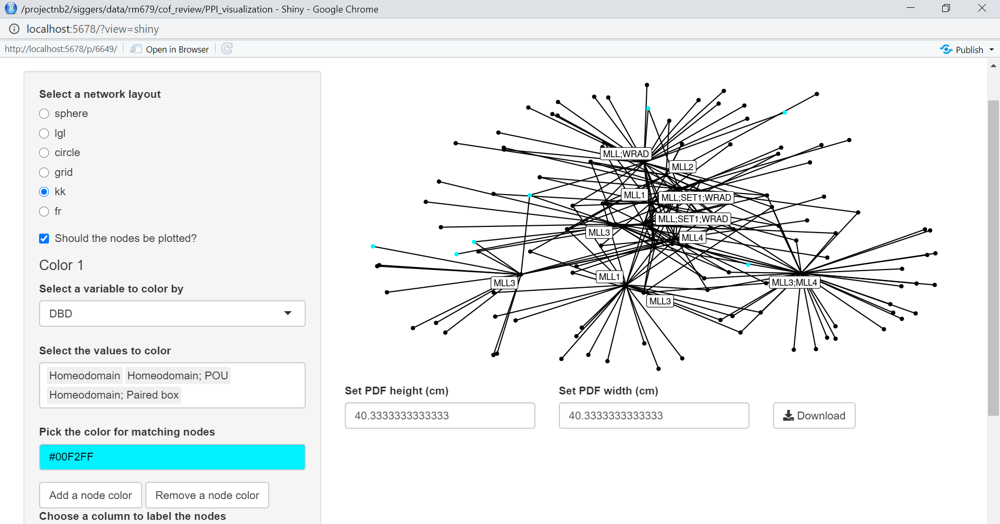

# PPI_Visualization

## Introduction

Interactive app for visualizing cofactor/transcription factor protein-protein interactions.

## Dependencies

NOTE: The default versions of the required packages available on the BU SCC should be correct for all packages except shiny. See below for instructions on updating shiny.

This app was built in R 3.6.0 using the following packages:

|    library   | version |
|--------------|---------|
|     shiny    |  1.5.0  |
|    shinyjs   |   1.0   |
| colourpicker |   1.0   |
|      DT      |   0.6   |
|     plyr     |  1.8.4  |
|   tidyverse  |  1.2.1  |
|   ggplot2*   |  3.3.0  |
|    purrr*    |  0.3.2  |
|    tibble*   |  2.1.1  |
|    dplyr*    |  0.8.5  |
|    tidyr*    |  0.8.3  |
|   stringr*   |  1.4.0  |
|    readr*    |  1.3.1  |
|   forcats*   |  0.4.0  |
|   reshape2   |  1.4.3  |
|    igraph    | 1.2.4.1 |
|    ggraph    |  1.0.2  |

Packages marked with an asterisk are attached along with the tidyverse package.

To update to the most recent version of shiny, run the following commands to start an R session on the SCC (or see instructions in "App Overview" for running RStudio on the SCC):

```
module load R/3.6.0
R
```

Once in the R session, run the following commands to update and check your shiny version:

```
install.packages("shiny")
library("shiny")
sessionInfo()
```

The output of the `sessionInfo()` command will include a list of all attached packages. Check for "shiny_1.5.0" in the section "other attached packages." The screenshot below shows what the output of the `sessionInfo()` command should look like after all the required packages are attached when launching the app.



## App Overview

The app can be launched from RStudio by clicking the "Run App" button at the top of the source file pane when "app.R" is open. It can also be launched by using the command `runApp("path/to/app.R")`.

To run RStudio on the SCC without having to [set up X forwarding](http://www.bu.edu/tech/support/research/system-usage/getting-started/x-forwarding/), open a terminal window and type the command `ssh username@scc1.bu.edu -L XXXX:localhost:8787`, replacing `username` with your Kerberos login and `XXXX` with any four numbers. Enter your password when prompted, then open a browser window and navigate to `http://localhost:XXXX/`, again replacing `XXXX` with the same four numbers. Enter your Kerberos login when prompted, and you should then see an RStudio session running in your browser.

### Select and Filter Data

This first tab allows you to select which of the three available datasets you would like to analyze. Once you've selected a dataset, you can then apply filters if you wish to work with only a subset of the data. The filtered dataset will be displayed as an interactive table. Note that search terms are treated as full words that must be matched exactly. Thus, "MLL" does not match "MLL1," "MLL2", or "MLL3."



### Generate Heatmap

This tab allows you to generate a customizable heatmap showing the filtered dataset from the "Select and Filter Data" tab. You can select which variable you want to display along each axis as well as which numeric variable you want to color by, cluster the rows and/or the columns, add labels, change the color gradient, and turn the legend on or off. When you are happy with your heatmap, you can download it as PDF using the "Download" button below the plot. Note that the dimensions listed are estimates and may need to be adjusted.



### Generate Network

Like the "Generate Heatmap" tab, this tab allows you to generate a customizable network graph showing the filtered dataset from the "Select and Filter Data" tab. You can select a network layout, turn both nodes and edges on or off, label the nodes based on a certain variable, and color certain nodes. The plot can then be downloaded as a PDF using the "Download" button below the plot. Again, the dimensions listed may need to be adjusted.



